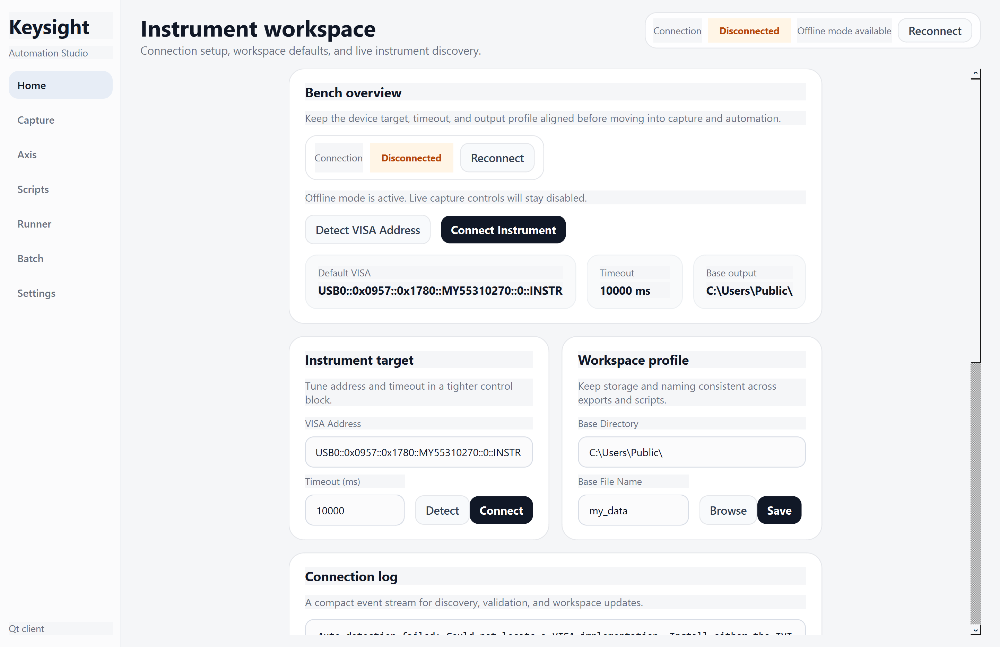
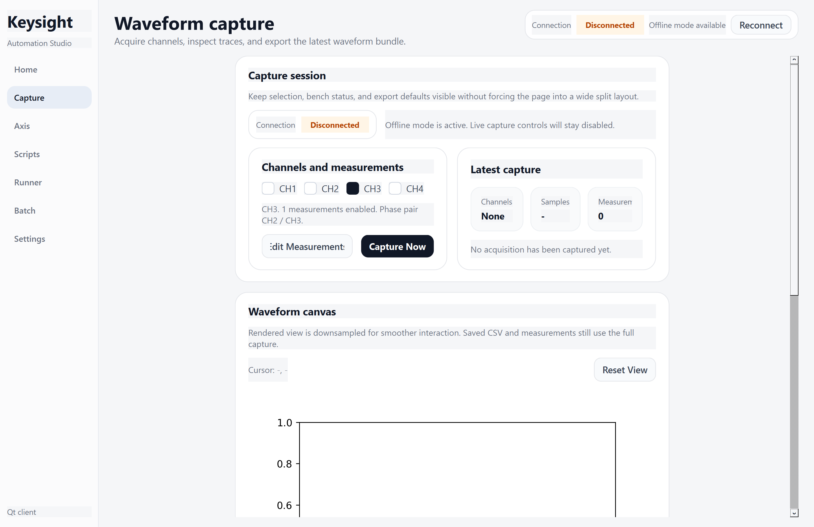
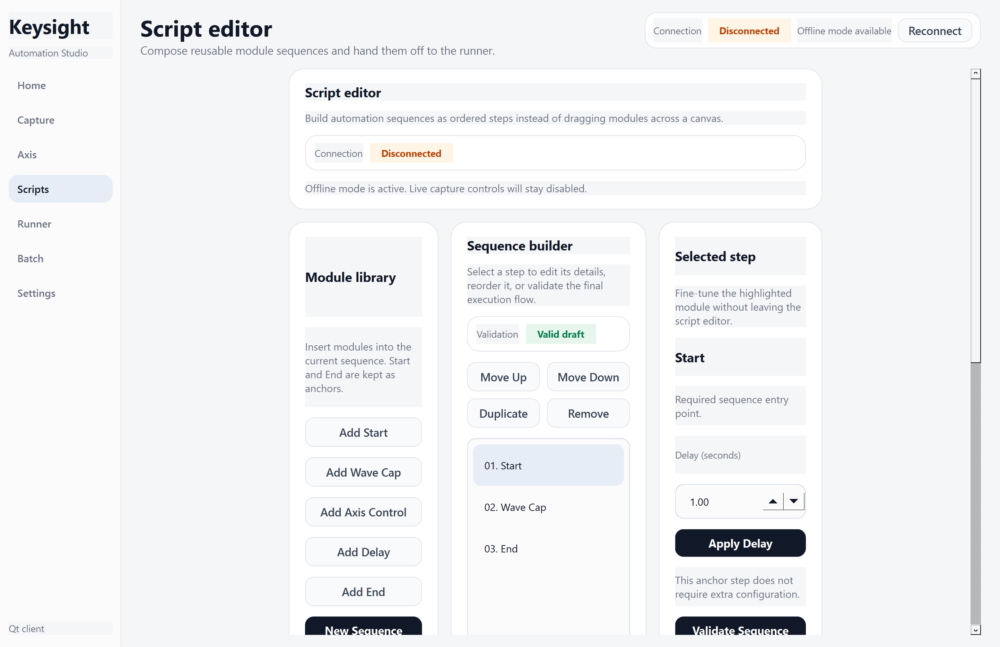
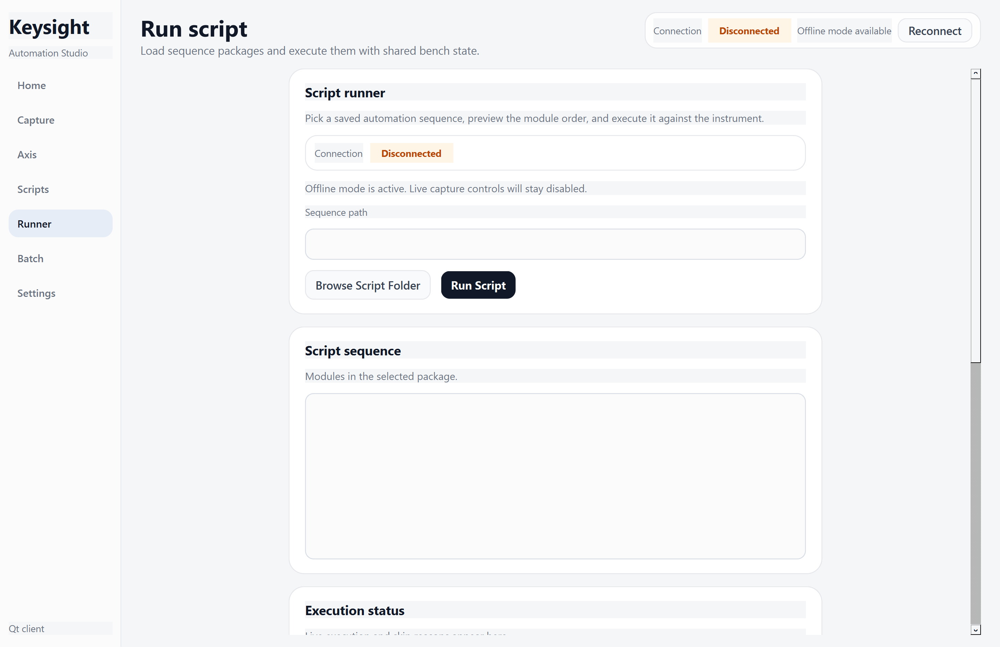
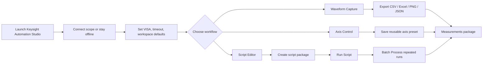

# Keysight Automation Studio

Keysight Automation Studio is a Windows desktop client for Keysight oscilloscope workflows. It combines instrument connection, waveform capture, axis presets, reusable script packages, and batch processing in one Qt-based application.

## Why This Project Exists

Most oscilloscope automation setups end up split across ad hoc scripts, exported CSV files, and fragile bench notes. This project turns that into a repeatable workflow:

- connect to a Keysight scope through VISA
- configure bench defaults once
- capture and export waveform data with measurement results
- save axis and waveform presets
- build reusable automation sequences
- run or batch-process those sequences from a single desktop UI

The current default application entrypoint is the Qt client in [main.py](/D:/GPT_Project/KeysightSoftware/main.py). The legacy Tk client is still available in [main_tk.py](/D:/GPT_Project/KeysightSoftware/main_tk.py).

## Product Tour

### Home



### Waveform Capture



### Script Editor



### Script Runner



## Workflow



## Core Capabilities

### Bench connection and offline mode

- Connect to a Keysight instrument through VISA.
- Keep working in offline mode when the oscilloscope is unavailable.
- Reconnect from the global status bar without leaving the current page.

### Waveform capture

- Select active channels and measurement items.
- Visualize the latest capture in-app.
- Export waveform bundles with measurement results.
- Reuse saved defaults from the shared `configs/` directory.

### Axis control

- Tune timebase, marker placement, and per-channel scale/position.
- Save presets for reuse across future sessions.
- Apply live settings only when a scope is connected.

### Script packaging

- Build ordered automation sequences instead of drag-and-drop canvases.
- Save a script package with its own `sequence.json` and `configs/`.
- Hand off directly to the runner page.

### Batch post-processing

- Consolidate repeated run folders into a final measurements package.
- Reduce manual merging after large bench sweeps.

## Application Structure

```text
KeysightSoftware/
|- main.py                      # Qt entrypoint
|- main_tk.py                   # legacy Tk entrypoint
|- keysight_software/
|  |- qt_app/                   # active desktop client
|  |- ui/                       # legacy Tk UI
|  |- device/                   # oscilloscope communication
|  |- utils/                    # waveform export helpers
|  |- paths.py                  # bundled resource + writable config paths
|- configs/                     # shared editable defaults
|- docs/images/                 # README screenshots
|- tests/                       # smoke tests + utility tests
```

## Quick Start

### Option 1: Run the packaged Windows build

1. Download the Windows standalone release asset.
2. Launch `KeysightSoftware.exe`.
3. If you need live instrument control, install NI-VISA or Keysight IO Libraries first.

### Option 2: Run from source

```powershell
python -m venv .venv
.\.venv\Scripts\Activate.ps1
python -m pip install -r requirements.txt
python .\main.py
```

## Requirements

### Runtime

- Windows
- Keysight or NI VISA runtime for live instrument communication

### Python dependencies

- `PySide6`
- `PyVISA`
- `matplotlib`
- `numpy`
- `pandas`
- `openpyxl`
- `Pillow`

Install with:

```powershell
python -m pip install -r requirements.txt
```

## Packaging

The application is packaged with PyInstaller. The current release build is a standalone single-file Windows executable, and the frozen runtime keeps bundled resources separate from user-writable config data.

Build locally with:

```powershell
python -m PyInstaller build.spec --noconfirm --clean
```

## Configuration

Shared application defaults live in [configs](/D:/GPT_Project/KeysightSoftware/configs):

- `axis_config.json`
- `waveform_config.json`
- `measurement_config.json`
- `script_editor_state.json`

Script packages created from the editor carry their own local `configs/` folder so a saved sequence can travel with the exact presets it depends on.

## Testing

The repository includes smoke tests for both the Qt shell and the legacy Tk compatibility layer, plus utility coverage for waveform export and frozen path handling.

Run the test suite:

```powershell
python -m unittest discover -s tests -v
```

## Notes

- The Qt client is the primary interface now.
- The Tk client remains available only for compatibility.
- If no oscilloscope is connected, the app still supports offline configuration, script editing, and package review workflows.
- The packaged Windows build is currently the primary release target.

## Project Description

Keysight Automation Studio is a Windows-first automation workstation for Keysight oscilloscopes. It is designed for lab users who want a cleaner path from instrument connection to data capture, reusable presets, scripted execution, and exportable measurement results without constantly switching between raw scripts and manual bench operations.
